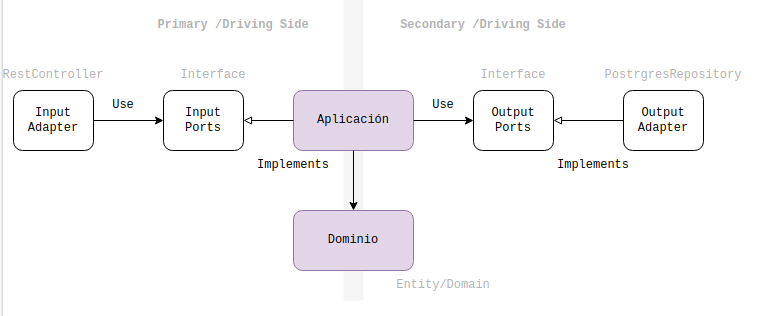

# Introducción a la Arquitectura Hexagonal

La arquitectura hexagonal, también conocida como "Arquitectura de Puertos y Adaptadores", es un enfoque de diseño de software que promueve la separación de preocupaciones y la independencia de los componentes. Este modelo arquitectónico facilita la creación de aplicaciones altamente mantenibles, escalables y fáciles de probar al definir límites claros entre el núcleo de la aplicación y sus interacciones externas.

## ¿Por qué elegir la Arquitectura Hexagonal?

1. **Independencia de la Infraestructura**: La arquitectura hexagonal permite que el núcleo de la aplicación sea independiente de las tecnologías y frameworks externos. Esto significa que puedes cambiar la base de datos, el framework web, o cualquier otra tecnología sin afectar la lógica de negocio central.

2. **Facilidad de Pruebas**: Al separar claramente la lógica de negocio de las interacciones externas, es más sencillo escribir pruebas unitarias y de integración, lo que mejora la calidad del software y facilita la detección de errores.

3. **Escalabilidad y Mantenibilidad**: La modularidad inherente de esta arquitectura permite escalar aplicaciones de manera más eficiente y facilita el mantenimiento a largo plazo, ya que los cambios en una parte del sistema tienen un impacto mínimo en otras partes.

4. **Adaptabilidad**: Con los puertos y adaptadores, es fácil integrar nuevos componentes o reemplazar los existentes, lo que hace que el sistema sea adaptable a nuevos requisitos o cambios tecnológicos.

## Estructura Básica

En la arquitectura hexagonal, el sistema se organiza en torno a tres componentes principales:

- **Núcleo**: Contiene la lógica de negocio y las reglas fundamentales de la aplicación. Es independiente de cualquier tecnología externa.
  
- **Puertos**: Interfaces que definen cómo interactúan los componentes internos con el mundo exterior. Los puertos pueden ser de entrada (para recibir comandos) o de salida (para enviar datos).

- **Adaptadores**: Implementaciones concretas de los puertos, que conectan el núcleo de la aplicación con tecnologías externas como bases de datos, interfaces de usuario, o servicios externos.

## Objetivo de la demo

Este proyecto tiene como objetivo implementar una aplicación en Springboot utilizando la arquitectura hexagonal. A través de este enfoque, buscamos demostrar cómo se puede lograr un diseño limpio y mantenible que se adapte fácilmente a cambios futuros.



## 1er Paso: Ejecutar Docker Compose para Iniciar PostgreSQL

En este paso, ejecutaremos Docker Compose para iniciar un contenedor con PostgreSQL. Asegúrate de tener Docker y Docker Compose instalados en tu sistema.

```yml
version: '3.5'

services:
  postgres:
    container_name: postgres
    image: postgres:11
    environment:
      POSTGRES_USER: postgres
      POSTGRES_PASSWORD: postgres
      POSTGRES_DB: defaultdb
      PGDATA: /data/postgres
    ports:
      - "5432:5432"
    restart: unless-stopped
```

Guarda este archivo como `docker-compose.yml` y ejecuta el siguiente comando en el terminal para iniciar el contenedor:

```bash
docker-compose up -d
```

## 2do Paso: Acceder a PostgreSQL con el Cliente psql

Una vez que el contenedor de PostgreSQL esté en funcionamiento, puedes acceder a él usando el cliente `psql`. Ejecuta el siguiente comando:

```bash
psql -h 127.0.0.1 -U postgres postgres
```

Esto te conectará a la base de datos `postgres` utilizando el usuario `postgres`.

## 3er Paso: Crear el Proyecto Spring Boot

Ahora, crearemos un proyecto Spring Boot con arquitectura hexagonal. Sigue estos pasos para configurar el proyecto:

```bash
mkdir hexagonal
cd hexagonal/
mkdir -p src/{main,test}/{java,resources}
```

Este comando creará la estructura básica de directorios para un proyecto de Spring Boot. Luego, crea el archivo `pom.xml` para gestionar las dependencias de Maven. Puedes editarlo usando un editor de texto como `gedit`:

```bash
sudo gedit pom.xml
```

Asegúrate de definir las dependencias necesarias para tu proyecto en el archivo `pom.xml`.

Finalmente, puedes verificar la conexión a PostgreSQL ejecutando una consulta simple (asegúrate de estar conectado a la base de datos):

```sql
SELECT * FROM customer;
```

Este conjunto de pasos te guiará a través de la configuración inicial de tu entorno de desarrollo con Docker, PostgreSQL y un proyecto Spring Boot estructurado según la arquitectura hexagonal.


git config --global user.name "Tu Nombre"
git config --global user.email "jpalomino93@hotmail.com"
